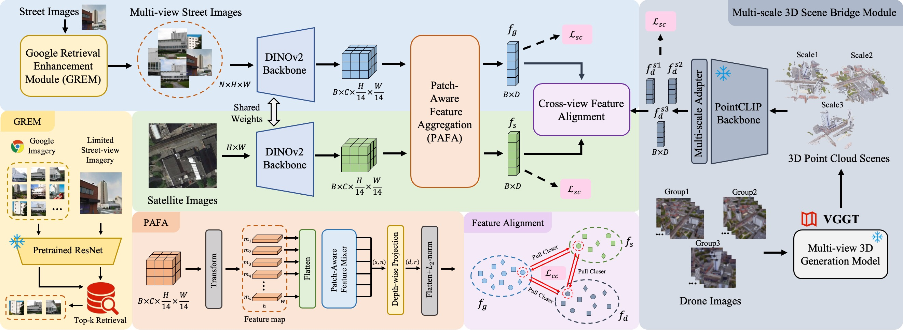

# SkyLink: Unifying Street-Satellite Geo-Localization via UAV-Mediated 3D Scene Alignment
Official implementation of 2025 ACM'MM UAV Challenging paper SkyLink (https://codalab.lisn.upsaclay.fr/competitions/22073), TeamName: XMUSmart.

## News
🚩 **2025.07.07: Comming Soon! Codes will be released upon the paper's publicationd.**

🚩 **2025.07.24: Our paper has been accepted by ACM'MM 2025 UAVM. The codes for training has been released!**

## Description 📜
This research mainly focus on ground-satellite geo-localization. We aims at robust feature retrieval under viewpoint variation and propose the novel SkyLink method. Meanwhile, we integrate the 3D scene information constructed from multi-scale UAV images as a bridge between street and satellite viewpoints, and perform feature alignment through self-supervised and cross-view contrastive learning.

## Framework 🖇️
<td style="text-align: center"></td>

## Requirements
### Installation
Create a conda environment and install dependencies:
```bash
conda create -n cvgl python=3.10
conda activate cvgl

# Install the according versions of torch and torchvision
conda install pytorch torchvision cudatoolkit
```

## Quick Start
To train SkyLink model, you can run the following command:
```
python train_universityMM.py
```
To test SkyLink model with test-time augmentation (TTA) in the competition, you can also run the command:
```
python test_mm_tta.py
```
We reconstruct the point-clouds from multi-view UAV images by VGGT model, you can refer to \url{https://github.com/facebookresearch/vggt}.

## Acknowledgements

## Contact
If you find our work useful, please consider citing:

## Contact
If you have any question about this project, please feel free to contact hyzhang@stu.xmu.edu.cn.
